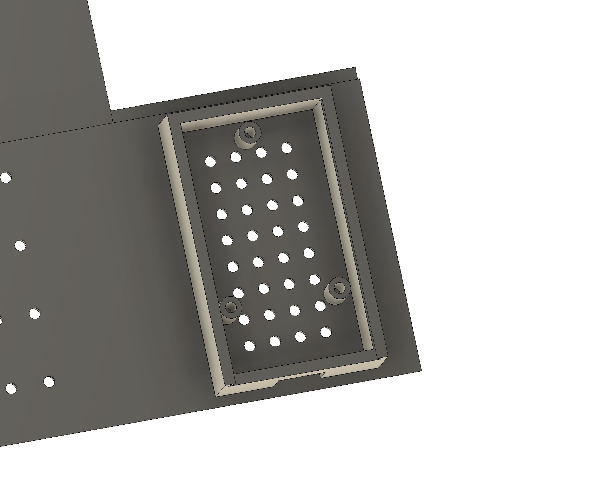
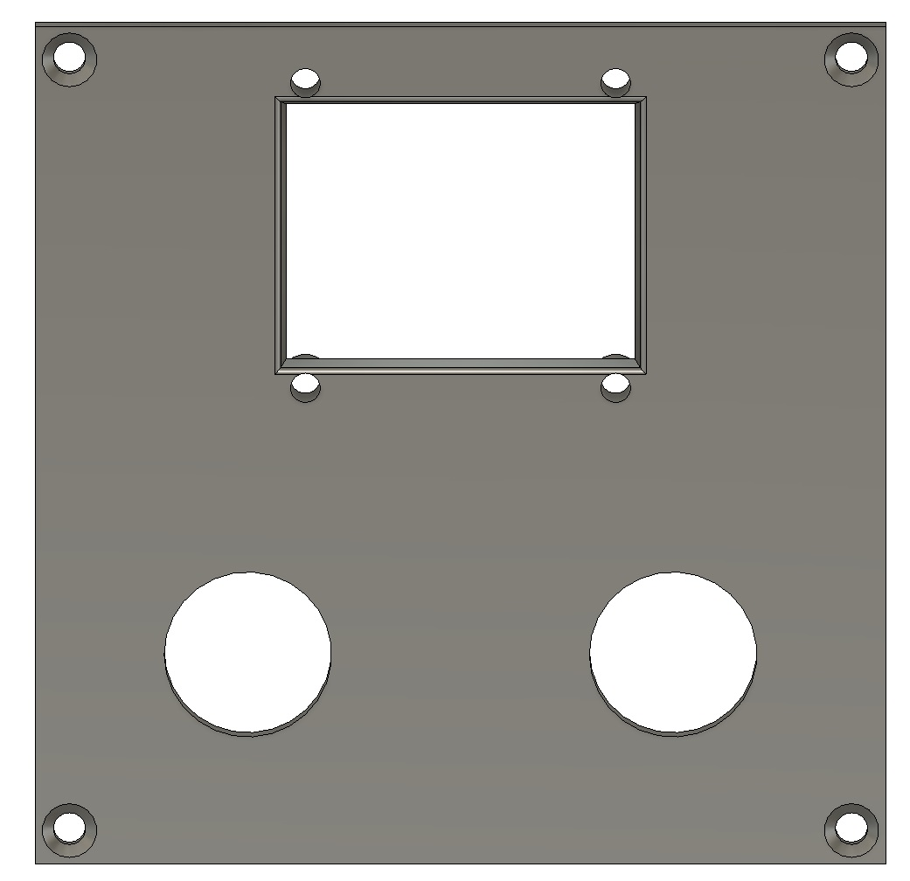
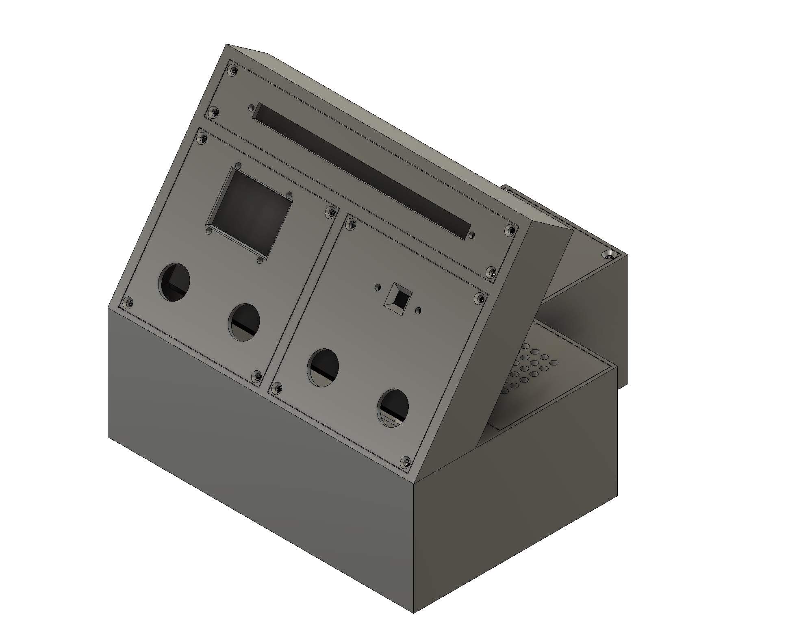
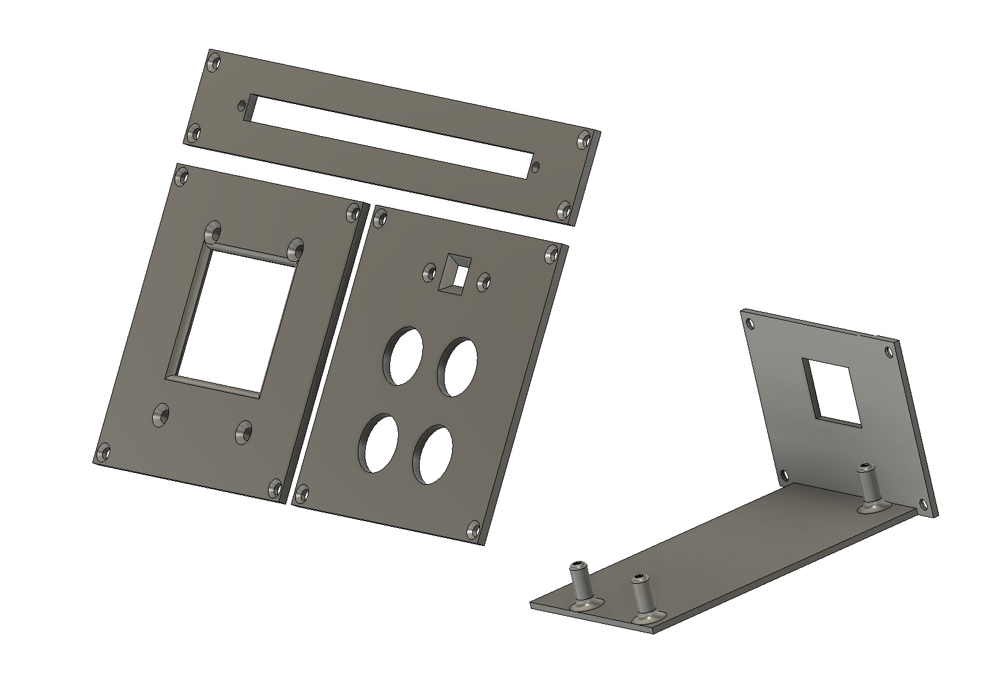

# Control Center Box

## Overview

Following up some inspiration from a recent [BPS Space video](https://youtu.be/4jgTCayWlwc?si=eSv1VP0tFDjUAst9&t=457) which induced some additional motivation....including "Learning CAD"...I've now "FINISHED THIS PROJECT!!!"...right?

Anyways....

This repository contains CAD files and images for the **Control Center Box** project. The Control Center Box is a customizable enclosure designed for housing electronics such as OLED displays, Ethernet modules, and LED control systems. It is suitable for 3D printing and provides modular inserts for various configurations.

The rear insert included is for a keystone where you can use anything from a CAT5/6 Ethernet insert, Barrel Jack (for DC power), HDMI etc.

[Download the zip folder for all the files listed below.](./files/ControlCenterBox.zip)

It currently talks to Home Assistant over MQTT (and ESPHome) and I have included the [ControlCenter.yml](./ControlCenter.yaml) file and an example [secrets.yaml](./secrets.yaml) file with some placeholder variables.

Currently it houses: 

1. Olimex [ESP32-POE-ISO IoT development board with 100Mb Ethernet, Power over Ethernet, WiFi, BLE](https://www.olimex.com/Products/IoT/ESP32/ESP32-POE-ISO/open-source-hardware)
2. Adafruit [Grayscale 1.5" 128x128 OLED Graphic Display](https://www.adafruit.com/product/4741)
3. Seeed Studio [Grove - RGB LED Stick (15-WS2813 Mini)](https://www.seeedstudio.com/Grove-RGB-LED-Stick-15-WS2813-Mini-p-4270.html)
4. Seeed Studio [Grove - RGB LED (WS2813 Mini)](https://www.seeedstudio.com/Grove-RGB-LED-WS2813-Mini-p-4269.html)
5. Parallax [BME680 Environmental Sensor](https://www.parallax.com/product/bme680-environmental-sensor/)
6. Miscelaneous Normally Open (N.O) buttons ^but theses are not currently implemented yet

And also has compatible faceplates for a DFRobot [Monochrome 0.96" 128x64 I2C/SPI OLED Display](Https://www.dfrobot.com/product-2017.html)

## Completed Build Pictures


## Project Structure
```
3D_Printing/ControlCenterBox/
├── Files
│   ├── BaseBox.f3d
│   ├── BaseBox.step
│   ├── BaseBox.stl
│   ├── BaseLid.f3d
│   ├── BaseLid.step
│   ├── BaseLid.stl
│   ├── Base_AND_Screen.f3d
│   ├── Base_AND_Screen.step
│   ├── Base_AND_Screen.stl
│   ├── Center_Screen_LED_Insert.f3d
│   ├── Center_Screen_LED_Insert.step
│   ├── Center_Screen_LED_Insert.stl
│   ├── Left_Screen_OLED_and_Buttons.f3d
│   ├── Left_Screen_OLED_and_Buttons.step
│   ├── Left_Screen_OLED_and_Buttons.stl
│   ├── Rear_Extension_Insert_Single_Keystone.f3d
│   ├── Rear_Extension_Insert_Single_Keystone.step
│   ├── Rear_Extension_Insert_Single_Keystone.stl
│   ├── Right_Screen_WLED_and_Dual_Buttons.f3d
│   ├── Right_Screen_WLED_and_Dual_Buttons.step
│   ├── Right_Screen_WLED_and_Dual_Buttons.stl
│   ├── Right_Screen_WLED_and_Quad_Buttons.f3d
│   ├── Right_Screen_WLED_and_Quad_Buttons.step
│   ├── Right_Screen_WLED_and_Quad_Buttons.stl
│   ├── Screen.f3d
│   ├── Screen.step
│   └── Screen.stl
├── Images
    ├── Adafruit-OLEDInsert-FrontProfile.jpg
    ├── Adafruit-OLEDInsert-SideRearProfile.jpg
    ├── CompletedBuild_FrontLeft.jpg
    ├── CompletedBuild_FrontProfile.jpg
    ├── CompletedBuild_RearRight.jpg
    ├── ControlCenterBox-BaseLid-FrontRightCorner.jpg
    ├── ControlCenterBox-BaseLid-RightRearUnderside.jpg
    ├── ControlCenterBox-BaseShell.jpg
    ├── ControlCenterBox-FrontProfile-Empty.jpg
    ├── ControlCenterBox-FrontRightCorner-Empty.jpg
    ├── ControlCenterBox-FrontRightCorner-Full.jpg
    ├── ControlCenterBox-Hero-WithBlanks.jpg
    ├── ControlCenterBox-Hero.jpg
    ├── ControlCenterBox-RearProfile.jpg
    ├── ControlCenterBox-RearRightCorner-WithKeystoneInsert.jpg
    ├── ControlCenterBox-RearRightCorner-WithOlimexInsert.jpg
    ├── ControlCenterBox-RearRightCorner.jpg
    ├── ControlCenterBox-ScreenShell.jpg
    ├── DFRobot-OLEDInsert-FrontProfile.jpg
    ├── DFRobot-OLEDInsert-SideRearProfile.jpg
    ├── Hero-Inserts.jpg
    ├── Hero-Inserts-Alt.jpg
    ├── RearInsert-Olimex-ESP32-POE-MountBoard-Front.jpg
    ├── RearInsert-Olimex-ESP32-POE-MountBoard-Rear.jpg
    ├── RearInsert-SingleKeystone-Front.jpg
    ├── RearInsert-SingleKeystone-Rear.jpg
    ├── Seeed-WLEDSingleInsertWithDualButtons-FrontProfile.jpg
    ├── Seeed-WLEDSingleInsertWithDualButtons-SideRearProfile.jpg
    ├── Seeed-WLEDSingleInsertWithQuadButtons-FrontProfile.jpg
    ├── Seeed-WLEDSingleInsertWithQuadButtons-SideRearProfile.jpg
    ├── Seeed-WLEDStripInsert-FrontProfile.jpg
    └── Seeed-WLEDStripInsert-SideRearProfile.jpg
```

## Description of Components

### Combo Base and Screen 

- **Base_AND_Screen.f3d**, **Base_AND_Screen.step**, **Base_AND_Screen.stl**: Start here as this is the file which combines both the base and screen into a single print. [Download Base_and_Screen Files](./files/Base_AND_Screen.stl). 


### Base and Lid
- **BaseBox.f3d**, **BaseBox.step**, **BaseBox.stl**: Main enclosure base for holding components. [Download BaseBox Files](./files/BaseBox.stl)
- **BaseLid_WithSeeedBME680.f3d**, **BaseLid_WithSeeedBME680.step**, **BaseLid_WithSeeedBME680.stl**: Lid that includes vent holes and a mounting box for a Seeed Studio BME680. [Download BaseLid Files](./files/BaseLid_WithSeeedBME680.stl)
- **BaseLid.f3d**, **BaseLid.step**, **BaseLid.stl**: Lid that secures onto the base for easy access. No venting [Download BaseLid Files](./files/BaseLid.stl)

#### Images
- **Base Lid with Seeed BME680 and Vents**: Highlights the assembled base and lid, venting and mount for the BME sensor.     


- **Base Lid**: Highlights the assembled base and lid from a front-right perspective.  
- **Base Lid Underside**: Underside view of the base and lid assembly.  

### Shell
- **Base_AND_Screen.f3d**, **Base_AND_Screen.step**, **Base_AND_Screen.stl**: A modular shell designed to house screens or other inserts. [Download Shell Files](./files/Base_AND_Screen.stl)

#### Images
- **Base Shell**: Displays the base with the screen shell attached.  
- **Screen Shell**: Standalone view of the screen shell.  

### Inserts
1. **Center Screen LED Insert**
   - **Center_Screen_LED_Insert.f3d**, **Center_Screen_LED_Insert.step**, **Center_Screen_LED_Insert.stl**: Insert designed for a central screen LED. [Download Center LED Insert Files](./files/Center_Screen_LED_Insert.stl)
   - **Images**:
     - **LED Strip Front Profile.jpg**: Front view of the OLED insert.  
     - **LED Strip Rear Profile.jpg**: Side and rear view of the OLED insert.  

2. **Left Screen - Adafruit OLED (128x128)**
   - **Adafruit_OLED.f3d**, **Adafruit_OLED.step**, **Adafruit_OLED.stl**: Insert designed for the Adafruit 128x128 OLED display. [Download OLED Screen & Buttons Insert Files](./files/Adafruit_OLEDInsert.stl)  

3. **Left Screen - DFRobot OLED (128x64) and Buttons**
   - **Left_Screen_OLED_and_Buttons.f3d**, **Left_Screen_OLED_and_Buttons.step**, **Left_Screen_OLED_and_Buttons.stl**: Insert designed for OLED displays. [Download OLED Screen & Buttons Insert Files](./files/Left_Screen_OLED_and_Buttons.stl)  

4. **Right Screen - WLED and Dual Buttons**
   - **Right_Screen_WLED_and_Dual_Buttons.f3d**, **Right_Screen_WLED_and_Dual_Buttons.step**, **Right_Screen_WLED_and_Dual_Buttons.stl**: Insert designed for a Single WS2813 WLED module and dual buttons. [Download Single WLED & Dual Buttons Insert Files](./files/Right_Screen_WLED_and_Dual_Buttons.stl)   

5. **Right Screen - WLED and Quad Buttons**
   - **Right_Screen_WLED_and_Quad_Buttons.f3d**, **Right_Screen_WLED_and_Quad_Buttons.step**, **Right_Screen_WLED_and_Quad_Buttons.stl**: Insert designed for a Single WS2813 WLED module and Quad buttons. [Download Single WLED & Quad Buttons Insert Files](./files/Right_Screen_WLED_and_Quad_Buttons.stl)   

6. **Rear Extension - Olimex Slider**
   - **Rear_Extension_Insert_Olimex_Slider.f3d**, **Rear_Extension_Insert_Olimex_Slider.step**, **Rear_Extension_Insert_Olimex_Slider.stl**: Insert designed for an Olimex ESP32 PoE ISO board with the ethernet port exposed out the back for connection. [Download Rear Insert - Olimex Slider Files](./files/Rear_Extension_Single_Keystone.stl)  

7. **Rear Extension - Single Keystone**
   - **Rear_Extension_Insert_Single_Keystone.f3d**, **Rear_Extension_Insert_Single_Keystone.step**, **Rear_Extension_Insert_Single_Keystone.stl**: Insert designed for a single Keystone insert. [Download Rear Insert - Single Keystone Files](./files/Rear_Extension_Single_Keystone.stl)  

### Hero Images
- **Control Center Box**: Fully assembled Control Center Box in its default configuration. Adafruit OLED and quad button with single WS2813 WLED  
- **Control Center Box - Alternative Inserts**: Fully assembled Control Center Box in its alterntive configuration. DFRobot OLED and dualbuttons with single WS2813 WLED. 
- **Control Center Box - With Blanks**: Fully assembled box with blank inserts for customization.  
- **Hero-Inserts.jpg**: Showcases all available inserts together.  
- **Hero-Inserts-Alt.jpg**: Alternative ineserts with dual buttons and smaller OLED and a dual button WLED right insert. 
### Additional Views
- **ControlCenterBox-FrontProfile-Empty.jpg**: Front profile of the box without any inserts.  
- **ControlCenterBox-FrontRightCorner-Empty.jpg**: Front-right corner view of the empty box.  
- **ControlCenterBox-FrontRightCorner-Full.jpg**: Front-right corner view of the box with inserts installed.  
- **ControlCenterBox-RearProfile.jpg**: Rear profile of the box.  
- **ControlCenterBox-RearRightCorner.jpg**: Rear-right corner view of the box.  
- **ControlCenterBox-RearRightCorner-WithOlimexInsert.jpg**: Rear-right corner view with an Ethernet insert installed.  
- **ControlCenterBox-RearRightCorner-WithKeystoneInsert.jpg**: Rear-right corner view with an Ethernet insert installed.  

## Printing Instructions
1. **Recommended Settings**:
   - Material: PLA or PETG
   - Layer Height: 0.2mm
   - Infill: 20% (adjust based on strength requirements)
   - Supports: Required for overhangs (e.g., Keystone insert area, screen seperator bars)

2. **Assembly**:
   - Print the combined base and screen first
   - Choose and print the necessary inserts based on your hardware and a base lid as well
   - Secure inserts into the shell and mount the shell to the base.
     - The inserts are screwed into the body using m2.5x4mm screws. 

3. **Customization**:
   - Modify the CAD files to fit additional components if needed.

## Usage
- Ideal for prototyping small electronic projects.
- Modular design allows for easy customization and reconfiguration.
- Suitable for DIY home automation and display projects.

